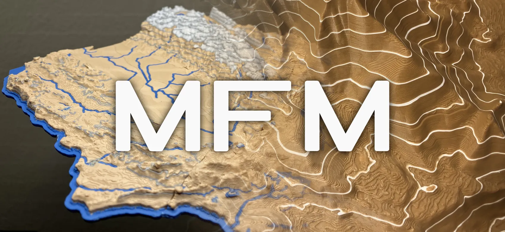
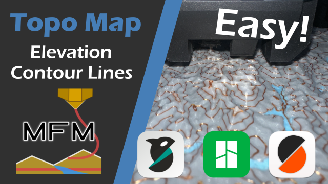
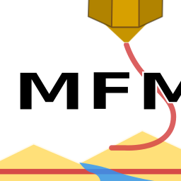

# 3D G-code Map Feature Modifier (MFM)

Add colored [isolines (contour lines/elevation lines)](https://en.wikipedia.org/wiki/Contour_line) and recolor [elevation ranges](https://desktop.arcgis.com/en/arcmap/latest/map/styles-and-symbols/working-with-color-ramps.htm) to [3D printable map models](https://ansonliu.com/maps/). **3D G-code Map Feature Modifier (MFM)** is a G-code Post Processor made for 3D topo map models but any 3D model can be recolored with 2 additional colors.

: ↑ MFM Tutorial video

**Use the latest version of MFM in 1 of the following 3 ways → [Getting Started](#getting-started)**

- [MFM App](https://github.com/ansonl/mfm/releases) - Easiest to use and get started with a graphical user interface. Supports G-code and Plate Sliced 3MF (G-code embedded 3MF). Precompiled for Windows/Linux/Mac
- [Integrated Post Processing Script in PrusaSlicer/Bambu Studio/Orca Slicer](https://github.com/ansonl/mfm/archive/refs/heads/master.zip) - Runs automatically after slicing. Supports G-code.
- [Python Script](https://github.com/ansonl/mfm/archive/refs/heads/master.zip) - Runnable from command line. Supports G-code.

**MFM adds additional features to the model by post processing sliced [3D printer G-code](https://marlinfw.org/meta/gcode/). 3D models and printing g-code can be recolored at either layer or individual feature/line level granularity.**

- **Feature/Line Type Scoping** - Recoloring can be set to only affect specific printing feature/line types. *Recolor only the top surfaces or walls at certain heights with MFM!*

- **G-code Feature Print Order Optimization** - Printed features are rearranged for faster, more consistent prints. Nozzle pressure is maintained and the number of toolchanges is minimized.

- **Wipe/Coasting Compensation** - Existing Wipe/Coasting flow compensation generated by the slicer is retained even when g-code features are relocated. MFM has a customizable flush volume based on the color used and can do a **Long retraction after cut** to reduce filament waste.

- **Prime Tower Aware** - Existing Prime Towers are reused for optimal filament flow and color flushing. *No prime tower or large prime tower? Both configurations are supported.*

- **Slicer Compatibility** - Tested to be compatible with PrusaSlicer, Bambu Studio, and OrcaSlicer. Supports G-code and Plate Sliced 3MF.

- **G-code Gadgets** - MFM's G-code parser has an advantage over other post-processers because it organizes existing G-code features into reusable segments similar to [gadgets](https://www.youtube.com/watch?v=ajGX7odA87k&t=1868s) which are rearranged and chained for printing efficiency.

If you find this tool helpful, please leave feedback and consider supporting my development and 3D modeling with a [Printables](https://www.printables.com/@ansonl) "club membership" or a one-time [Paypal](https://paypal.me/0x80) contribution.

My 3D topo and other models are on [MakerWorld](https://makerworld.com/en/@ansonl) and [Printables](https://www.printables.com/@ansonl).

## Current G-code flavors supported

- Marlin 2 ([PrusaSlicer](https://github.com/prusa3d/PrusaSlicer)/[Bambu Studio](https://github.com/bambulab/BambuStudio)/[Orca Slicer](https://github.com/SoftFever/OrcaSlicer))

> Your slicer **must generate g-code with [Relative Extrusion](https://www.ideamaker.io/dictionaryDetail.html?name=Relative%20Extrusion&category_name=Printer%20Settings)**. PrusaSlicer, Bambu Studio, and Orca Slicer default to relative extrusion. Cura defaults to absolute extrusion and relative extrusion must be explicitly enabled.

| Slicer | Tested Version |
| --- | --- |
| PrusaSlicer | 2.7.1 |
| Bambu Studio | 1.8.2.56 |
| Orca Slicer | 2.2.0 |
| Cura | N/A |

If you would like support for your printer or slicer G-code flavor to be added, please open an issue and test the G-code on your printer.

## Getting Started

Set up your slicer and printer for MFM by following the steps on each page below:

1. [Slicer Setup](slicer-setup.md)

2. [MFM Command Setup](terminal-setup.md) ***(Post Processing and Command Line only)***

3. [Minimal Toolchange G-code](minimal-toolchange-gcode.md)

4. [MFM Config Options](mfm-configuration-options-setup.md)

5. [MFM Usage and Printer Setup](printer-setup.md)

## Running MFM Post-processor

After doing ALL above setup steps, you can run MFM as a Slicer Post-processor Script/Python Script or Graphical App:

### Graphical App (GUI)

Download the [latest GUI release of MFM](https://github.com/ansonl/mfm/releases) and run `MFM.exe` to start MFM.

1. Select the [import Plate Sliced 3MF or G-code](./slicer-setup.md) that was exported from your slicer

2. Select the [MFM Options JSON](./mfm-configuration-options-setup.md) for your model.

3. Select the [toolchange G-code](./minimal-toolchange-gcode.md) for your printer.

4. Check if the exported 3MF or G-code file location looks right

5. Press **Post Process**

> If a release of MFM has not been built for your OS, you can launch the GUI by [downloading the code](https://github.com/ansonl/mfm/archive/refs/heads/master.zip), navigate to the code folder in the command line and run `python src/gui.py`.

### Slicer Post-processor Script or Python Script in Command Line

1. Add `mfm_cmd.py` command with the [listed parameters](terminal-setup.md) to slicer **Post-processing Scripts** setting.

2. **Slice** your model.

3. **Export Plate Sliced 3MF/G-code file** under the Print button in the upper right or File menu.

> If you update the MFM Options file, you may need to add/delete a space at the end of the slicer **Post-processing Scripts** setting to get the slicer to allow reslicing.

> ⚠️ **Known bug: The first color change may be set to the wrong color.** If the first color change is incorrect, open the G-code in a text editor and search for `TX` (e.g. `T3`) where `X` is the wrong color index and **replace the first match of `T3` with `T0`** or desired base starting color index. This issue randomly occurs ~50% of the time due to a known 10+ year old Windows Python [bug](https://stackoverflow.com/questions/15934950/python-file-tell-giving-strange-numbers).

### Printing Your Processed 3MF/G-code

#### Plate Sliced 3MF

Open the processed 3MF in your slicer and **Send/Print** to your printer.

#### G-code

Place the processed G-code file an SD card and put the SD card in your 3D printer or transfer the G-code file to your printer over a network.

See [Printer Setup](./printer-setup.md) for more options and important set up steps.

## Frequently Asked Questions

| Question | Solution |
| --- | --- |
| How do I convert a 3D model into G-code for printing? | After importing and slicing your model in a slicer software, export the 3D printer commands as [ASCII] G-code. MFM can be process and recolor this saved G-code file. |
| MFM did not add or change any colors. | Setup your slicer for MFM through [Slicer Setup](slicer-setup.md) |
| How can MFM recoloring be customized? | Read [Options](mfm-configuration-options-setup.md) for details. |
| How can MFM be used with a material other than PLA and customized toolchange? | See [Minimal Toolchange G-code](minimal-toolchange-gcode.md) on recommendations on how to setup your own toolchange. I may add an option to set toolchange temperatures based on material in the future. Open an issue with your use cases. |
| Incorrect color was printed even though previewing the exported G-code in the slicer shows the correct color slots being used. | Assign a different filament to each slot in the Bambu AMS. Every slot with a different color **must have a different color assigned** in AMS. Otherwise Bambu AMS [Autoswitch](https://forum.bambulab.com/t/automatic-material-switch-over/4189) feature may try to use a single slot's filament for a shared material and color between multiple slots. |
| Mixed OS line endings in the same file will lead to G-code errors. MFM tries to auto detect the line ending used with first line ending found. | Select the correct line ending of your G-code instead of auto detect. Either convert the entire G-code file with Unix line endings to Windows line endings before post processing or generate the G-code on Windows. [Python on Windows does not handle Unix line endings correctly.](https://stackoverflow.com/questions/15934950/python-file-tell-giving-strange-numbers) |
| Only one isoline interval and/or colored elevation range can be set. | Only one of each is exposed at the moment. The implementation could support more in the future if there is a use case. |
| Support and Bridge features are not explicitly prioritized to pprint first.  | I could prioritize printing certain features first in the future. Open an issue with your use cases for this. |

## Bug Reports

Open an issue on Github. Please note the OS, Slicer, printer, and provide the 3D model, MFM Options JSON, toolchange G-code, and logs. 

Logs are written to your home directory `~` in the files `mfm-script.log` and `mfm-script-stderr.log`.

## License and Disclaimer

GNU AFFERO GENERAL PUBLIC LICENSE v3.0

Copyright © 2023-2024 Anson Liu

THE SOFTWARE IS PROVIDED “AS IS”, WITHOUT WARRANTY OF ANY KIND, EXPRESS OR IMPLIED, INCLUDING BUT NOT LIMITED TO THE WARRANTIES OF MERCHANTABILITY, FITNESS FOR A PARTICULAR PURPOSE AND NONINFRINGEMENT. IN NO EVENT SHALL THE AUTHORS OR COPYRIGHT HOLDERS BE LIABLE FOR ANY CLAIM, DAMAGES OR OTHER LIABILITY, WHETHER IN AN ACTION OF CONTRACT, TORT OR OTHERWISE, ARISING FROM, OUT OF OR IN CONNECTION WITH THE SOFTWARE OR THE USE OR OTHER DEALINGS IN THE SOFTWARE.
