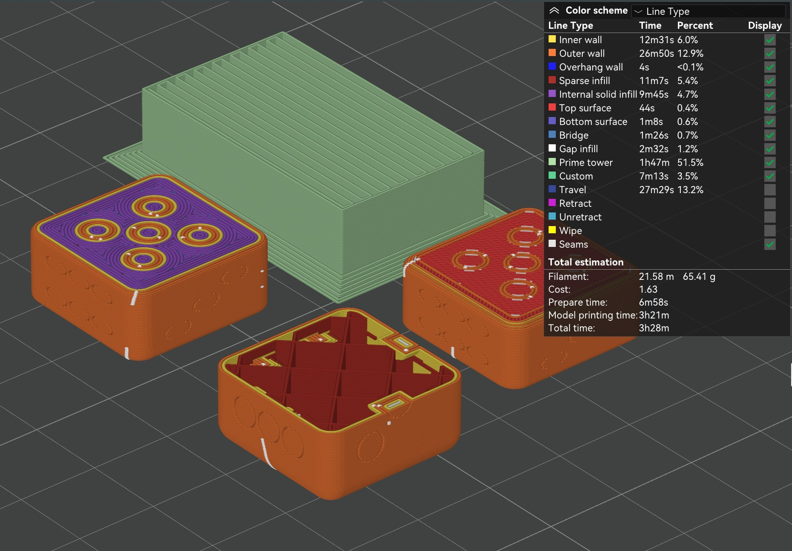

# MFPP Configuration

## Feature Options

The options file is formatted as a JSON dictionary with the following keys. Options values are provided for each [3D printable map model](https://ansonliu.com/maps/) on the [specifications page](https://ansonliu.com/maps/specifications/).

Filament/color positions are 0-based. The first position is represented by 0. The recommended filament order is:

| Physical Position (left to right) → | 1 | 2 | 3 | 4 |
| -------- | ------- | ------- | ------- | ------ |
| 0-based index in options | `0` | `1` | `2` | `3` |
| **Purpose** | Primary (base) | Secondary (hydro) | *Isoline* | *Elevation Color Change* |

### Example Options file with Isoline and Elevation Change features

```json
{
    "modelToRealWorldDefaultUnits": 1000,
    "modelOneToNVerticalScale": 250000,
    "modelSeaLevelBaseThickness": 3.6,
    "realWorldIsolineElevationInterval": 500,
    "realWorldIsolineElevationStart": 500,
    "realWorldIsolineElevationEnd": 30000,
    "modelIsolineHeight": 0.1,
    "isolineColorIndex": 2,
    "isolineColorFeatureTypes": [
        "Outer wall",
        "Inner wall",
        "External perimeter",
        "Perimeter"
    ],
    "realWorldElevationReplacementColorStart": 2000,
    "realWorldElevationReplacementColorEnd": 30000,
    "replacementColorIndex": 3,
    "replacementOriginalColorIndex": 0
}
```

### Required Options

| Key | Value | Cardinality | Description |
| -------- | ------- | ------- | ------- |
| `modelToRealWorldDefaultUnits` | *(model-units:real-world-units)* | 1 | Model units to Real World units scale. **Model Gcode units usually default to millimeters.** Use one of the two below computed values. |
| `modelToRealWorldDefaultUnits` (millimeters:meters)  | `1000` | 1 | Use `1000` if you specify real world units in meters. |
| `modelToRealWorldDefaultUnits` (millimeters:feet)  | `304.8` | 1 | Use `304.8` if you specify real world units in feet. |
| `modelOneToNVerticalScale` | *(real-world-scale:model-scale)* | 1 | Model to Real World scale *(E.g. 1:500000 = 0.1mm:50m)* |
| `modelSeaLevelBaseThickness` | `float` | 1 | The model height at sea level (0 m) in model units. This is used as zero elevation for the isoline and elevation color change. *(E.g. 1.8 = 1.8mm)*|

### Isoline Options

| Key | Value | Cardinality | Description |
| -------- | ------- | ------- | ------- |
| `realWorldIsolineElevationInterval` | `float` | 1 | Isoline elevation interval in real world units. |
| `realWorldIsolineElevationStart` | `float` | 1 | Isoline starting elevation in real world units. |
| `realWorldIsolineElevationEnd` | `float` | 1 | Isoline ending elevation in real world units. |
| `modelIsolineHeight` | `float` | 1 | Isoline display height in model units. |
| `isolineColorIndex` | `integer` | 1 | Isoline filament/color loaded position. Recommended index is 2 (third slot). |
| `isolineColorFeatureTypes` | `[string]` | ≥0 | List of printing object feature/line types (extrusion roles) to recolor at isoline elevations. Empty array will recolor all feature types. Feature types are case sensitive. |

#### Feature Types (Extrusion Roles)

3D printed Feature Types are different categories used to define printing order and settings of printing travel and extrusion movements.

- `wall`s are vertical features. Wall/Perimeter on [Cura](https://support.makerbot.com/s/article/1837650983225) and [PrusaSlicer](https://help.prusa3d.com/article/layers-and-perimeters_1748#perimeters).
- `surface`s are the horizontal features that make up the top and bottom layers of 3D objects. Surface/top and bottom on [Cura](https://support.makerbot.com/s/article/1667410780032) and [PrusaSlicer](https://help.prusa3d.com/article/layers-and-perimeters_1748#solid-layers-top-bottom)
- `infill`s are the interior features. Infill on [Cura](https://support.makerbot.com/s/article/1667411002588) and [PrusaSlicer](*https://help.prusa3d.com/article/infill_42)
- `support` is an extra structure generated by the slicer to hold up overhanging parts of the model against gravity when printing. You do not need supports enabled when printing the 3D maps. Support on [Cura](https://support.ultimaker.com/s/article/1667417606331) and [PrusaSlicer](https://help.prusa3d.com/article/organic-supports_480131)
- `prime tower` is an extra structure generated by the slicer to get consistent flow after a toolchange. Depending on the colors you use and amount of small features in the model, you can disable or reduce the Prime Tower size. Prime/Wipe tower on [Cura](https://support.makerbot.com/s/article/1667418002331) and [PrusaSlicer](https://help.prusa3d.com/article/wipe-tower_125010)



Modifying the feature types colored at an isoline elevation will drastically the isoline's visual appearance. Different materials and colors will adhere to each other differently so strength can be affected.

Feature Types vary depending on the slicer used to generate the G-code. You can view supported feature types for your slicer by previewing your G-code and setting the *Color scheme* to `Line Type`. [PrusaSlicer and BambuStudio extrusion roles source](https://github.com/prusa3d/PrusaSlicer/blob/97c3679a37e9ede812432e25a096e4906110d441/src/libslic3r/GCode/GCodeProcessor.cpp#L2486).

MFPP rearranges printing order of features to reduce the number of toolchanges a layer. Isoline recolored features are printed first. This may affect print quality of supported parts but you can work around that by specifying the `Support` and `Bridge` feature types for recoloring.

### Elevation Change Options

| Key | Value | Cardinality | Description |
| -------- | ------- | ------- | ------- |
| `realWorldElevationReplacementColorStart` | `float` | 1 | Elevation based replacement color start elevation in real world units. |
| `realWorldElevationReplacementColorEnd` | `float` | 1 | Elevation based replacement color end elevation in real world units. |
| `replacementColorIndex` | `integer` | 1 | Elevation based replacement color filament/color loaded position. Recommended index is 3 (fourth slot). |
| `replacementOriginalColorIndex` | `integer` | 1 | Elevation based replacement color **replaced** filament/color loaded position. Recommended index is 0 (first slot). |
