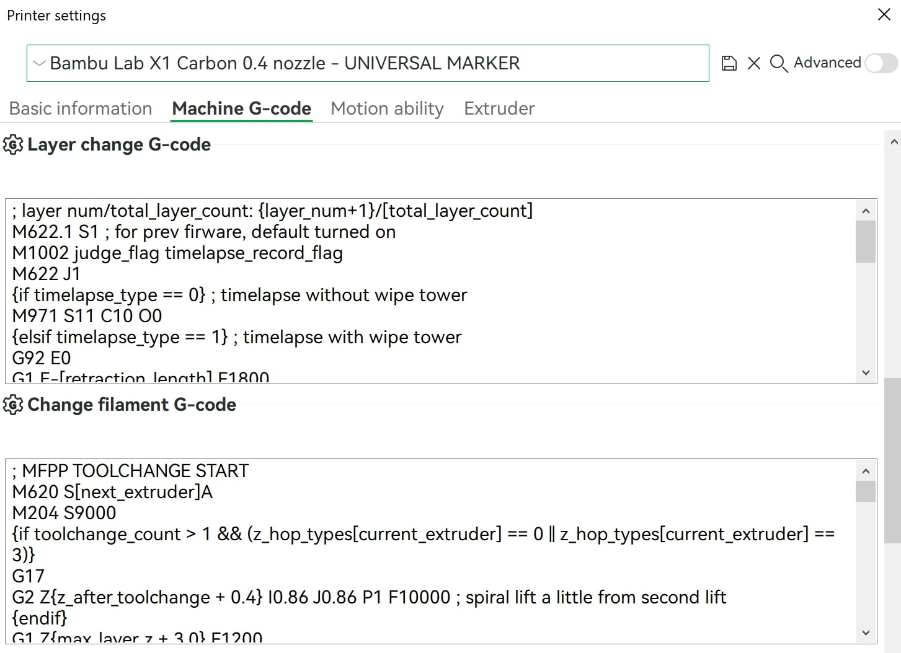
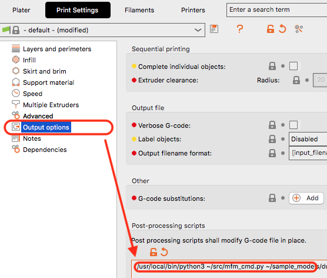

# Slicer Setup for MFM

## G-code coordinate positioning mode

All printing G-code must use [Relative Positioning for Extrusion](https://www.ideamaker.io/dictionaryDetail.html?name=Relative%20Extrusion&category_name=Printer%20Settings).

Printhead XYZE absolute positioning mode can be set with `G91` and only the Extruder (E) can be set to relative positioning with `M83`. If too little/too much filament is extruded, check to see if your extrusion positioning is incorrectly set to absolute in the slicer.

## Set Printer G-code

Add markers in your slicer software G-code for the end of new layer change and start and end of toolchange.

Save the printer profile with a new name and select the new printer profile for your prints.



### PrusaSlicer / BambuStudio / Orca Slicer steps

1. Printer > Settings > **Custom G-code / Machine G-code**

2. Add `; MFM LAYER CHANGE END` on a new line at the end of **After layer change G-code / Layer change G-code**.

3. Add `; MFM TOOLCHANGE START` on a new line at the beginning of **Tool change G-code / Change filament G-code**.

4. Add `; MFM TOOLCHANGE END` on a new line at the end of **Tool change G-code / Change filament G-code**.

5. If you do not have the Bambu specific **Long retraction when cut** `long_retractions_when_cut` option enabled for any of the used filament profiles, skip to last step.

6. **Long retraction only:** Add `; EXTRA_PURGE_INSERTION` on a new line after the last `{if flush_length_4 > 1}...{endif}` block. The added new line must be before the last occurance of `; FLUSH_START`.

7. The resulting settings text fields should have an order like below

#### [After] Layer change G-code

```gcode
; Existing layer change G-code stays HERE

; MFM LAYER CHANGE END
```

#### Tool change G-code / Change filament G-code

```gcode
; MFM TOOLCHANGE START

; Existing toolchange G-code stays HERE

; MFM TOOLCHANGE END
```

#### Tool change G-code / Change filament G-code - Long retraction version

```gcode
; MFM TOOLCHANGE START ; <-- Add this line

; Existing toolchange G-code stays HERE
{if flush_length_4 > 1} ; <-- This should be the last high extruding flush
... <-- Last extruding flush G-code
{endif}

; EXTRA_PURGE_INSERTION ; <-- Add this line

; FLUSH_START <-- This is a short flush that does not extrude much
M400
...
; Existing toolchange G-code stays HERE

; MFM TOOLCHANGE END ; <-- Add this line
```

## Set Filament Settings

### `Long retraction when cut` (Bambu Studio/Orca Slicer)

Bambu Slicer and Orca Slicer have a conditional section in the toolchange that uses a proprietary G-code `M620.11` to perform a longer retraction before cutting filament. This can reduce purged filament by 20-30% on average.

For every filament used:

1. Filament > **Setting Overrides**

2. Check or Uncheck `Long retraction when cut` respectively if you want **Long retraction when cut** enabled or disabled.

> `M620.11` command parameter asks for the previous extruder index for some movements that strictly speaking, should not need it. MFM is compatible with `M620.11` and can do long retractions by tracking the previous tool.

## Set Post-processing Scripts *(optional)*

Add MFM as a post-processing script if you want to automatically run MFM in your Slicer.

If you plan to do the processing through the standalone MFM GUI app, you can skip this step.

### PrusaSlicer

1. Set the settings view to **Expert Mode** in the upper right.

1. Print Settings > Output options > **Post-processing scripts**



### Bambu Studio / Orca Slicer

1. Enable **Advanced** view for Process

1. Process > Others > **Post-processing scripts**

### Next Steps for All Slicers

3. Create the MFM command text as described in [MFM Command Setup](terminal-setup.md)

4. Add the final command text to **Post-processing scripts**

## Slicer Print Settings

### Ironing

If you intend to add isolines and using Ironing on the top surface, the standard ironing inset will cover up the isoline color on the outer wall.

Set Ironing inset to your line width (nozzle diameter) multiplied between 1 and 1.25 to not obscure the isolines.
